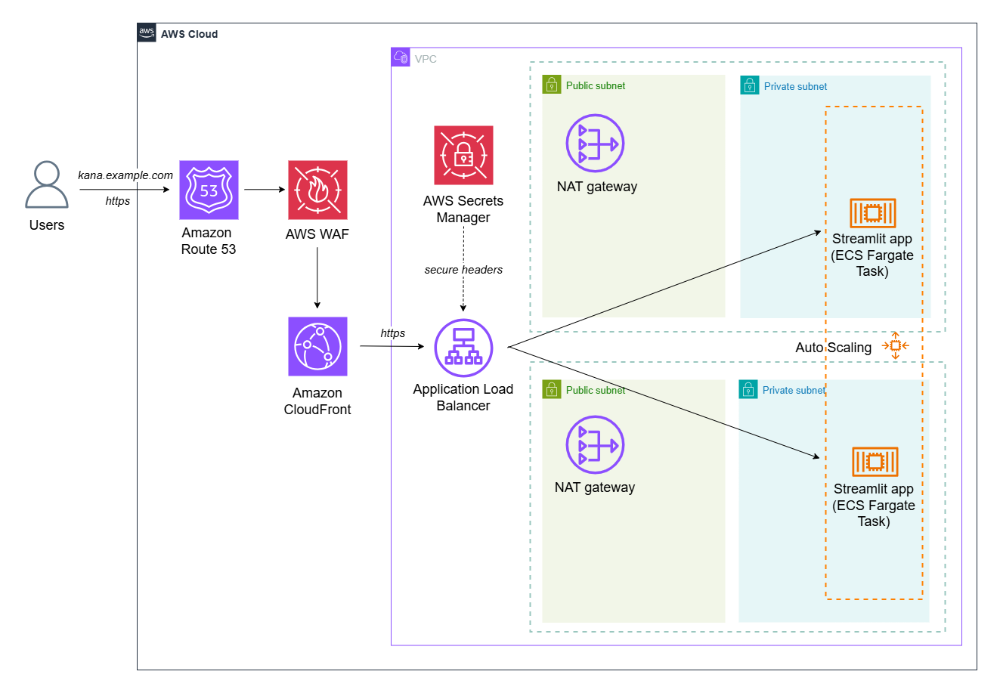

# Streamlit Kana app with AWS deployment

Learn Japanese kana (Katakana, Hiragana) with the help of a Streamlit app deployed on AWS!

## If you need simple and quick deployment

If you want to deploy in a simple and fast way, please use the [`main`](https://github.com/dashapetr/kana--streamlit-app/) branch.